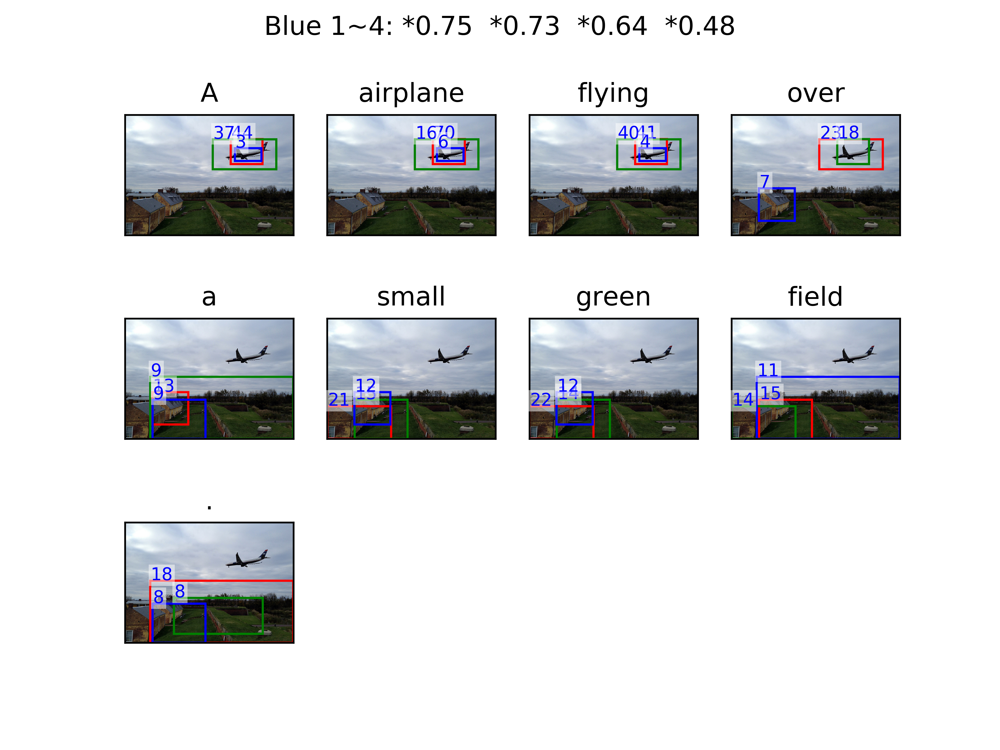

# Visualize Attention Result

* This folder contains script to visual attention models result for each image.

* Before Runing scripts in this folder, make sure you have done operations listed in the **Main README.md**. You don't need to download **pretrained ResNet-101 model** and don't need to run script:

```
cd $REPO_ROOT
./scripts/generate_baseline.py
```

* Operations to create attention images are as follows:

## 1. Create attention info files for each image:

```
cd $REPO_ROOT/visualize_attention
python create_image_attention_info.py
```

This script will create one json file for each image in a newly create dir named `debug_att_dir`.

## 2. Merge attention info files into one json list:

```
python merge_image_attention_infos.py
```

This script will create one json file named `merged_att_result.json` in current dir.

## 3. Create images with attention bounding boxes:

```
python create_attention_images.py \
	--id2info_json merged_att_result.json \
	--image_dir 'your coco image root dir' \
	--top_n 3 \
	--result_dir 'choose one dir to save the attention images'
```

`image_dir` should be the parent dir of `val2014` or `train2014`.

## 4. Result attention image:

Open `result_dir` dir to see attention images. One like this:


